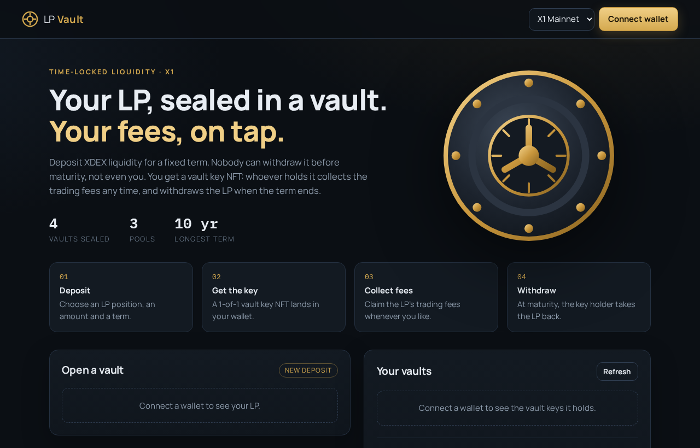
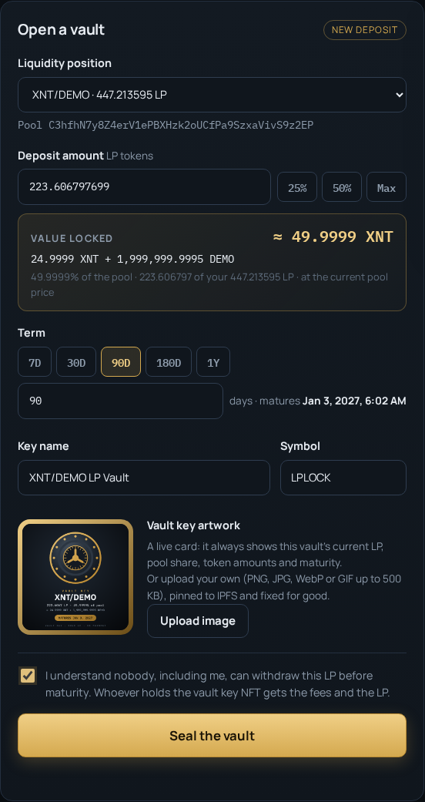
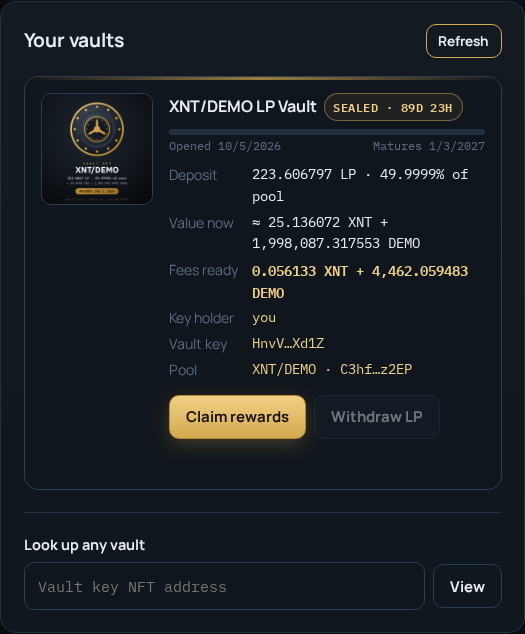
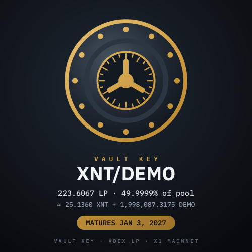
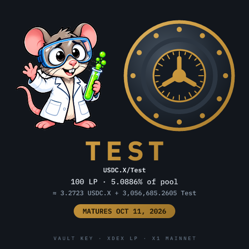
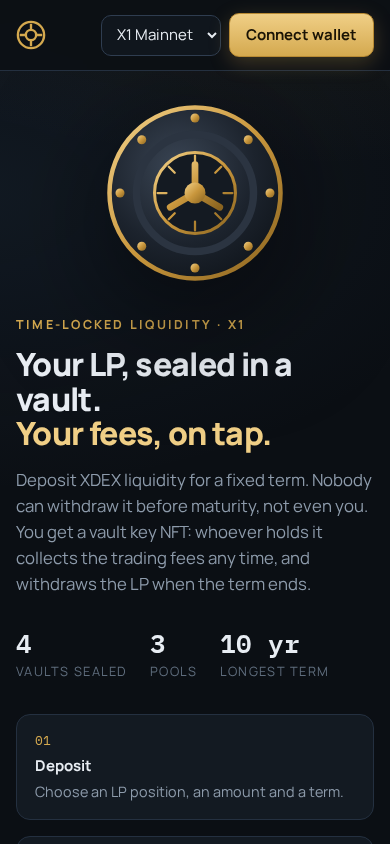

# LP Token NFT: time-locked XDEX liquidity in an NFT, on X1

Lock XDEX LP tokens for a fixed time. Locking mints a 1-of-1 **Metaplex NFT** to you, and that
NFT is the key to the position:

- **The LP can't be withdrawn by anyone until the lock ends.** There is no admin key, no early
  exit and no fee switch in the program.
- **Whoever holds the NFT can claim the LP's rewards at any time**, during the lock and after it.
  These are the XDEX trading fees the locked liquidity earns. Only the fee growth is withdrawn,
  and the locked principal is never touched (the program checks this after every claim).
- **After the lock ends, the NFT holder unlocks.** All of the LP goes to them, the NFT is burned
  and the rent from every account goes back to them.
- Rights follow the NFT: transferring or selling it transfers the rewards and the LP with it.

Built from two earlier projects:
[x1-reflection-token](https://github.com/Lokoweb3/x1-reflection-token)'s `lp_locker` (XDEX LP
vault, fee-growth maths, XDEX `withdraw` CPI) and
[token-lock-nft-x1](https://github.com/Lokoweb3/token-lock-nft-x1) (Metaplex NFT receipt,
self-deploy model). Each vault key shows a live card drawn from on-chain data; custom art is
pinned to IPFS through Pinata.

There's a **website** (`web/`, live at https://lp-lock-nft.vercel.app) for locking, claiming and
withdrawing with a browser wallet, and a **command line** (`cli/`). Both share the same client code.

## Screenshots



| Open a vault | Your vaults |
|---|---|
|  |  |

| Vault key NFT (live card) | One-of-one layout, set by pool | Phone |
|---|---|---|
|  |  |  |

The app screenshots use a throwaway test wallet and a demo pool (XNT/DEMO) on a local copy of X1
mainnet. The home page and the one-of-one card are from the live site.

> **Unaudited.** Read the program (`programs/lp_lock_nft/src/lib.rs`, about 670 lines including tests) before trusting
> it with real liquidity. Until you make it immutable (see [Deploy](#deploy-to-mainnet)),
> whoever holds the upgrade key can change it.

## How it works

| Instruction | Who | What |
|---|---|---|
| `lock_lp(amount, lock_duration, name, symbol, uri)` | LP owner | Moves `amount` LP into a vault PDA, records `unlock_at = now + lock_duration` (max 10 years) and mints the NFT (Metaplex metadata + master edition, max supply 0). |
| `claim_rewards(min_token_0, min_token_1)` | NFT holder | Withdraws only the LP worth more than the principal through XDEX and sends both pool tokens to the holder. The minimums guard against a manipulated pool. |
| `unlock()` | NFT holder, after `unlock_at` | Sends every LP token in the vault to the holder, closes the vault and the lock, and burns the NFT through Metaplex. |

**How rewards are measured.** In a constant-product pool, `sqrt(reserve0 × reserve1)` per LP token
only grows, and only from trading fees; deposits and withdrawals leave it unchanged. At lock time the
program records the locked liquidity in `sqrt(k)` units (rounded up). A claim withdraws exactly the
LP worth more than that, rounded down. Afterwards the vault is re-checked to confirm it still covers
the principal.

Accounts: `Lock` PDA `["lock", nft_mint]`, LP vault PDA `["vault", lock]`. One program-wide PDA
`["nft_authority"]` mints every NFT and is its (immutable) metadata update authority.

**Costs per lock** (mainnet): about 0.026 XNT plus the network fee. All of it comes back on unlock
except Metaplex's 0.01 XNT protocol fee. Every transaction is simulated first and asks for only the
compute it uses, because X1 charges for the compute units requested.

## Layout

```
programs/lp_lock_nft/src/lib.rs   the Anchor program (+ unit tests)
client/lp-lock-nft.ts             PDAs, decoding, reward quote, lock/claim/unlock builders
client/xdex.ts                    XDEX pool reading (+ create pool / swap, used by tests)
client/tokens.ts                  token and NFT names (Token-2022 / Metaplex metadata)
client/tx.ts                      simulate, fit the compute limit, send and confirm
server/pin.ts                     Pinata pinning of NFT art + metadata (key stays server-side)
api/pin.ts                        the Vercel function wrapping server/pin.ts
web/src/                          the website (main.ts, wallet.ts, art.ts), bundled by web/build.mjs
web/public/                       index.html, style.css and the built app.js
web/dev-server.ts                 local server for the site and /api/pin
cli/lp-lock.ts                    command line (mainnet by default)
tests/e2e-local.ts                program end-to-end test on a local clone of X1 mainnet
tests/web-e2e.ts                  browser test of the website (Playwright) on the same clone
```

The builders return instructions and never sign. The site and the CLI build the same transactions;
only the signer differs.

## Setup

Needs Node 18+, Rust, and the Agave **3.1.x** tools (`cargo-build-sbf`, `solana-test-validator`).

```bash
npm install
npm run build            # mainnet build -> target/deploy/lp_lock_nft.so
npm run build:testnet    # testnet XDEX   -> target/deploy-testnet/lp_lock_nft.so
```

Builds use the same `Cargo.lock` as x1-reflection-token's `lp-locker` (anchor 0.32.1).

## Tests

```bash
npm run test:rust        # reward maths
npm run typecheck
```

The end-to-end test runs the **mainnet build** against a local validator that clones X1 mainnet's
XDEX, its fee config and Metaplex. Nothing is sent to mainnet. The validator command is in the
header of `tests/e2e-local.ts`; then:

```bash
npm run test:e2e
```

It creates a TOKEN/XNT pool, locks LP and checks the Metaplex 1/1, then checks that each of these
is rejected:

- early unlock
- a claim with no fees
- a lock longer than 10 years
- a lock with a swapped pool vault

It then generates trading fees and checks that:

- a claim pays exactly the quote, with XNT unwrapped, and leaves the principal intact
- the NFT moves to another wallet
- the old owner can no longer claim or unlock
- the new holder can claim, then unlock after the end and receive every LP token, with the NFT burned and all accounts closed

The **browser test** drives the website in Chromium with a test wallet (Wallet Standard, signing
with a local keypair), on the same local validator, with the dev server pinning to memory:

```bash
npx playwright install chromium   # once
npm run web:build -- --dev && npx tsx tests/web-e2e.ts
```

It checks that the pin service refuses a wallet without the LP and refuses non-images. It then
connects the wallet and checks that the page finds the wallet's LP. Finally it locks, claims and
unlocks through the page, checking the chain after each step, including the pinned metadata. It also
checks that a visitor opening a lock by link sees no buttons.

## Website

A static page plus one serverless function. Everything runs in the browser against the X1 RPC and
the visitor's wallet signs; the server never sees a key. The one server call is `/api/pin`, which
pins the NFT image and metadata to IPFS with your Pinata key.

The site has a vault/bank look (LP Vault: dark steel and brass, Manrope and IBM Plex Mono).

- **Open a vault:** finds the XDEX LP in the connected wallet and shows each pair. Pick an amount
  (25/50/Max) and a term (7D to 1Y, or any number of days up to 10 years). The vault key NFT art is a
  steel vault door drawn in the browser (pair, deposit, pool share, maturity date), or upload your
  own (up to 500 KB). **Seal the vault** stays disabled until the "can't withdraw early" box is ticked.
- **Your vaults:** every vault key the wallet holds, with its art, a term progress bar, deposit and
  current value, fees ready, **Claim rewards** and, at maturity, **Withdraw LP**.
- **Look up any vault:** `?nft=<mint>` shows any vault read-only. The NFT's metadata links back to that
  page.
- Hero stats count the open vaults and pools on the selected network.
- A Mainnet/Testnet switch, and a notice if the program isn't deployed on the chosen network.

**Live vault key (default).** New vaults' NFTs point at `/api/key/<nft>.json`. The site builds
that metadata from chain data on each request, and its image `/api/key/<nft>.png` is a 500×500 card
drawn on the server (`server/key-card.ts`: SVG rendered to PNG with resvg and the IBM Plex fonts in
`assets/fonts`). It always shows the vault's current LP, % of pool, ≈ token amounts (4 decimals),
maturity and footer. A **one-of-one layout** can be assigned by pool address in `ONE_OF_ONE`. Pool
`7drPqaqcXcyYmdo62xucGqZzALuPCbGBCXCT41nWMmQD` (USDC.X/Test) uses the TEST mascot, currently a
stand-in cut from vault `7Epm…`'s art. The lock form previews the exact card through
`/api/key/preview.png`. Cards are cached for 5 minutes, and a withdrawn vault's card returns an
uncached 404. **Keep `/api/key` and `/api/art` online for good:** NFT metadata is immutable, and
existing NFTs point at them. A custom upload instead pins a fixed image to IPFS (served from `/api/art`).

**The pin service is not an open upload service.** It only pins for a request that names a real
XDEX pool on the chosen network and a wallet that holds at least the LP being locked. It accepts
only a PNG, JPEG, WebP or GIF image up to 500 KB, and it builds the metadata JSON itself (pair,
pool, LP amount, pool share, lock days, network, link to the lock page). It doesn't prove the
caller owns that wallet, since that would cost an extra wallet prompt. Someone holding LP could
still pin images, so keep an eye on your Pinata usage.

**Run it locally:**

```bash
PINATA_JWT=<key> npm run web:dev                  # http://localhost:8820
FAKE_PIN=1 npm run web:dev                        # no Pinata: pins kept in memory
```

On localhost only, `?rpc=<url>` points the page at another RPC (e.g. a local validator), and the
dev server's pin check follows `RPC_MAINNET` / `RPC_TESTNET`.

**Deploy to Vercel:** `vercel.json` builds the site (`npm run web:build`) and the `api/pin`
function. In the Vercel project, set:

| Variable | |
|---|---|
| `PINATA_JWT` | Pinata API key with Files: Write (required for uploads) |
| `IPFS_GATEWAY` | optional, e.g. your dedicated gateway `https://<name>.mypinata.cloud/ipfs/` (default `gateway.pinata.cloud`) |
| `LP_LOCK_PROGRAM_ID` | optional, your program id if you redeployed under another one (or `_MAINNET` / `_TESTNET`) |
| `RPC_MAINNET`, `RPC_TESTNET` | optional, RPC the pin check uses |

Live at **https://lp-lock-nft.vercel.app** (project `lp-lock-nft`). To redeploy, build locally,
check the output, then upload only that output:

```bash
vercel build --prod && vercel deploy --prebuilt --prod
```

`.vercelignore` keeps `target/` (the program keypair) and the Rust sources out of any upload.
`package.json` pins `rpc-websockets` to 9.3.10 through `overrides`. web3.js would otherwise pull
in 9.3.9, which `require()`s an ESM-only `uuid` and crashes on Vercel's Node runtime.

The gateway URL plus the content ID must stay under Metaplex's 200-byte URI limit, which both the
default and dedicated gateways do.
## Command line

Mainnet by default (`--network testnet` for testnet). Everything that sends a transaction only
**simulates** it unless you add `--yes`. Pass `--program <id>` if you deployed your own instance.

```bash
npm run lp-lock -- status                              # your locks, rewards ready, unlock times
npm run lp-lock -- info --nft <mint>

# Lock all your LP of a pool for 90 days; the art is pinned to IPFS like the website does
PINATA_JWT=<key> npm run lp-lock -- lock --pool <xdex pool> --amount all --days 90 \
  --name "TOKEN/XNT LP Lock" --symbol LPLOCK --image art.png [--site https://<your site>/] --yes
#   ...or with metadata you already host:  --uri https://<gateway>/ipfs/<cid>

npm run lp-lock -- claim --nft <mint> --yes            # trading fees -> your wallet (XNT unwrapped)
npm run lp-lock -- unlock --nft <mint> --yes           # after the lock ends: LP back, NFT burned
```

`--amount` is in LP base units, or `all`. Pass `--seconds` in place of `--days` for an exact duration.

## Deploy to mainnet

Self-deploy: you deploy your own instance from your own keys.

1. **Program id.** `target/deploy/lp_lock_nft-keypair.json` is this instance's program keypair (it
   is gitignored and never committed). To use a fresh id, run `solana-keygen new -o
   target/deploy/lp_lock_nft-keypair.json`, put its pubkey in `declare_id!` in
   `programs/lp_lock_nft/src/lib.rs`, in `DEFAULT_PROGRAM` in `cli/lp-lock.ts` and in the test,
   then rebuild.
2. **Fund the deployer**: about 6 XNT at peak (2.86 XNT program rent, plus an equal temporary
   buffer that is refunded).
3. **Deploy:**
   ```bash
   npm run build
   solana program deploy target/deploy/lp_lock_nft.so \
     --program-id target/deploy/lp_lock_nft-keypair.json --url https://rpc.mainnet.x1.xyz
   ```
4. **Verify:** `solana program dump <id> chain.so --url https://rpc.mainnet.x1.xyz`, then compare
   `sha256sum` with your local build (if the dump is longer, compare the first `<build size>` bytes).
5. **Make it immutable** once you trust it, so nobody can ever change the rules on locked LP:
   `solana program set-upgrade-authority <id> --final --url https://rpc.mainnet.x1.xyz`

## Notes

- Works with any XDEX pool. Token-2022 pool sides (e.g. tax tokens) go through the same XDEX
  withdraw path as x1-reflection-token's `lp_locker`, which runs on such pools on mainnet, and the
  quote nets out their transfer fee. This repo's e2e test only covers a plain SPL TOKEN/XNT pool.
- The XDEX program id is compiled in: the default build targets mainnet
  (`sEsYH97wqmfnkzHedjNcw3zyJdPvUmsa9AixhS4b4fN`), and `--features testnet` targets testnet
  (`7EEuq61z9VKdkUzj7G36xGd7ncyz8KBtUwAWVjypYQHf`).
- A claim leaves a speck of rounding dust in value (XDEX rounds withdrawals down). The CLI skips a
  claim until both tokens would pay more than 0, because XDEX refuses zero-amount withdrawals.
- XDEX opens a newly created pool a short while after creation. Trading, and with it fees, starts
  from then.

MIT licence.
